# Model Workflow

This document provides a visual representation of the complete end-to-end workflow for the SmokeSignal-AI wildfire detection model.

## Model Development Pipeline

```mermaid
flowchart TD
    A[📊 Data Collection & Preprocessing] --> B[🏗️ Model Architecture & Training]
    B --> C[📈 Training Evaluation & Monitoring]
    C --> D[🧪 Model Testing & Validation]
    D --> E[💾 Performance Analysis & Deployment]
    
    %% Data Collection & Preprocessing Phase
    A --> A1[Dataset Download]
    A --> A2[Image Processing]
    A --> A3[Data Split]
    
    %% Model Architecture & Training Phase
    B --> B1[CNN Architecture]
    B --> B2[Training Configuration]
    B --> B3[Regularization]
    
    %% Training Evaluation & Monitoring Phase
    C --> C1[Training Metrics]
    C --> C2[Loss Monitoring]
    C --> C3[Overfitting Prevention]
    
    %% Model Testing & Validation Phase
    D --> D1[Test Evaluation]
    D --> D2[Performance Metrics]
    D --> D3[Real-world Testing]
    
    %% Performance Analysis & Deployment Phase
    E --> E1[Visualization]
    E --> E2[Model Saving]
    E --> E3[Production Ready]
    
    %% Styling - Dynamic theme compatible
    classDef phase fill:#f8fafc,stroke:#3b82f6,stroke-width:3px,color:#1e293b
    classDef subphase fill:#e2e8f0,stroke:#8b5cf6,stroke-width:2px,color:#334155
    
    %% Dark theme overrides
    classDef phaseDark fill:#1e293b,stroke:#60a5fa,stroke-width:3px,color:#f1f5f9
    classDef subphaseDark fill:#334155,stroke:#a78bfa,stroke-width:2px,color:#e2e8f0
    
    class A,B,C,D,E phase
    class A1,A2,A3,B1,B2,B3,C1,C2,C3,D1,D2,D3,E1,E2,E3 subphase
```

## Workflow Description

### 1. 📊 Data Collection & Preprocessing
- **Source**: Kaggle Wildfire Prediction Dataset
- **Size**: 42,850 total images (30,250 train, 6,300 validation, 6,300 test)
- **Classes**: Binary classification (Wildfire vs. No Wildfire)
- **Processing**: 64x64 pixel resizing, normalization to [0,1] range
- **Data Loading**: TensorFlow ImageDataGenerator for efficient batch processing

### 2. 🏗️ Model Architecture & Training
- **Type**: Convolutional Neural Network (CNN)
- **Architecture**: 
  - 2 Conv2D layers (32 and 64 filters)
  - 2 MaxPooling2D layers
  - Flatten layer
  - 2 Dense layers (128 and 1 neurons)
  - Dropout (0.5) for regularization
- **Training**: Adam optimizer, Binary Crossentropy loss, 5 epochs, batch size 32

### 3. 📈 Training Evaluation & Monitoring
- **Performance**: Training Accuracy: **94.82%**, Validation Accuracy: **95.95%**
- **Monitoring**: Real-time training and validation loss tracking
- **Prevention**: Dropout and early stopping strategies to prevent overfitting

### 4. 🧪 Model Testing & Validation
- **Test Dataset**: **6,300** images for final evaluation
- **Metrics**: Comprehensive performance evaluation (**Accuracy, Precision, Recall, F1-Score**)
- **Validation**: Real-world scenario **testing** and **production** readiness assessment

### 5. 💾 Performance Analysis & Deployment
- **Analysis**: Training curves visualization, confusion matrix, classification reports
- **Format**: Native Keras (**.keras**) format for modern deployment
- **Production**: Optimized for real-time inference and application integration

## Key Strengths

✅ **High Accuracy**: 95.95% validation accuracy  
✅ **Efficient Architecture**: Lightweight CNN suitable for real-time use  
✅ **Robust Preprocessing**: Handles various image formats and sizes  
✅ **Comprehensive Evaluation**: Multiple metrics and visualizations  
✅ **Production Ready**: Saved in modern Keras format  

---

*This simplified workflow represents the essential stages of the machine learning pipeline from data collection to model deployment, ensuring a robust and reliable wildfire detection system.*
