# SmokeSignal AI

**A CNN–based wildfire detection system** that analyzes satellite images to identify potential wildfires and sends automated alerts to emergency contacts.

<div align="center">
  
  
</div>

## Features

- **AI-Powered Detection**: Deep learning model for accurate wildfire identification
- **Real-time Analysis**: Instant processing with confidence scoring
- **Automated Alerts**: Email notifications to fire stations and emergency services
- **User-Friendly Interface**: Clean, professional Streamlit web application
- **Config-Aware Alerts**: Auto-enables email alerts when credentials are set
- **Secure Configuration**: Environment-based email setup (no credentials in code)
- **Confidence Scoring**: Detailed detection confidence levels

## How SmokeSignal AI works?

Just upload your satellite image—SmokeSignal AI instantly scans for wildfire signs, delivers a confidence score, and, if danger is detected, triggers real-time email alerts to keep you and emergency teams ahead of the threat.

## Model Development Pipeline

This diagram shows the complete end-to-end workflow of our wildfire detection model:

```mermaid
flowchart TD
    A[📊 Data Collection & Preprocessing] --> B[🏗️ Model Architecture & Training]
    B --> C[📈 Training Evaluation & Monitoring]
    C --> D[🧪 Model Testing & Validation]
    D --> E[💾 Performance Analysis & Deployment]
    
    %% Data Collection & Preprocessing Phase
    A --> A1[Dataset Download]
    A --> A2[Image Processing]
    A --> A3[Data Split]
    
    %% Model Architecture & Training Phase
    B --> B1[CNN Architecture]
    B --> B2[Training Configuration]
    B --> B3[Regularization]
    
    %% Training Evaluation & Monitoring Phase
    C --> C1[Training Metrics]
    C --> C2[Loss Monitoring]
    C --> C3[Overfitting Prevention]
    
    %% Model Testing & Validation Phase
    D --> D1[Test Evaluation]
    D --> D2[Performance Metrics]
    D --> D3[Real-world Testing]
    
    %% Performance Analysis & Deployment Phase
    E --> E1[Visualization]
    E --> E2[Model Saving]
    E --> E3[Production Ready]
    
    %% Styling - Dynamic theme compatible
    classDef phase fill:#f8fafc,stroke:#3b82f6,stroke-width:3px,color:#1e293b
    classDef subphase fill:#e2e8f0,stroke:#8b5cf6,stroke-width:2px,color:#334155
    
    %% Dark theme overrides
    classDef phaseDark fill:#1e293b,stroke:#60a5fa,stroke-width:3px,color:#f1f5f9
    classDef subphaseDark fill:#334155,stroke:#a78bfa,stroke-width:2px,color:#e2e8f0
    
    class A,B,C,D,E phase
    class A1,A2,A3,B1,B2,B3,C1,C2,C3,D1,D2,D3,E1,E2,E3 subphase
```



### Workflow Stages

1. **📊 Data Collection & Preprocessing**: Kaggle Wildfire Dataset (42,850 images) with 64x64 resizing and normalization
2. **🏗️ Model Architecture & Training**: CNN with Conv2D layers, MaxPooling, Dense layers, and Dropout regularization
3. **📈 Training Evaluation & Monitoring**: Real-time accuracy tracking (94.82% training, 95.95% validation)
4. **🧪 Model Testing & Validation**: Comprehensive evaluation on 6,300 test images
5. **💾 Performance Analysis & Deployment**: Native Keras format for production-ready inference

## Demo Email Alert

```
🔥Wildfire Detection Alert

Detection Time: 2025-08-17 05:32:51
System: SmokeSignal-AI Wildfire Detector

⚠️ A potential wildfire has been detected in the analyzed image.

Detection Level: 78.56%

format: PIL Image
width: 241
height: 148
channels: 3
aspect_ratio: 1.6283783783783783

Immediate Action Required
Contact local emergency services if confirmed
Monitor the area for further developments

This is an automated alert from SmokeSignal-AI.
Please verify all detections before taking action.

```

## What SmokeSignal-AI Detects

### Active Fire Indicators

- Smoke plumes and visible fire
- Bright thermal signatures
- Active fire areas and flame patterns

### Environmental Changes

- Burn scars and damage areas
- Thermal anomalies and heat patterns
- Vegetation changes indicating fire activity

## Technical Architecture

### Model Framework

- **Framework**: TensorFlow/Keras
- **Input**: Satellite images (auto-resized)
- **Output**: Binary classification with confidence scores
- **Processing**: Real-time analysis pipeline

### Preprocessing Pipeline

1. **Image Loading**: Multi-format support (JPG, PNG)
2. **Resizing**: Automatic dimension adjustment
3. **Normalization**: Pixel values scaled to [0, 1]
4. **Batch Processing**: Model-ready format

### Alert System

- **SMTP Integration**: Gmail SMTP for reliability
- **Rich Content**: Timestamps, confidence scores, details
- **Error Handling**: Graceful failure with user feedback

## User Interface Features

- **Clean detection interface** with file uploader
- **Expandable quick guide** for minimal, high-signal help
- **Real-time analysis** with progress/status indicator
- **Concise results display** with confidence score

## Data Privacy

- Images are processed in-memory for analysis and are not stored by the app.
- Email alerts include only detection metadata (timestamp, confidence, basic image info).
- No personal information is collected.

## Acknowledgments

- **TensorFlow/Keras** for deep learning framework
- **Streamlit** for the web application framework
- **OpenCV** for image processing capabilities
- **Gmail SMTP** for reliable email delivery

---

## 👨‍💻 Author

**Dhyan Patel**

- GitHub: [@dhyan2815](https://github.com/dhyan2815)
- LinkedIn: [Dhyan Patel](https://linkedin.com/in/dhyan-patel)
- Portfolio: [Dhyan Dev](https://dhyan-patel.onrender.com)

---

**SmokeSignal-AI** - _Empowering emergency services with AI-driven wildfire detection technology._ 🚀🌲🔥

<div align="center">
  <p>
    <a href="https://github.com/dhyan2815/SmokeSignal-AI/issues">🐛 Report Bug</a> •
    <a href="https://github.com/dhyan2815/SmokeSignal-AI/issues">💡 Request Feature</a>
  </p>
</div>
