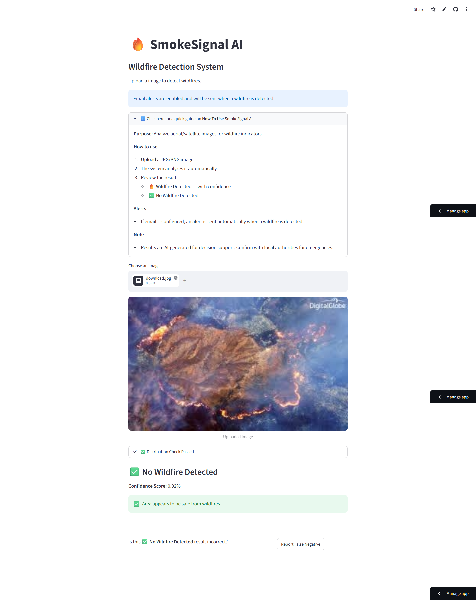
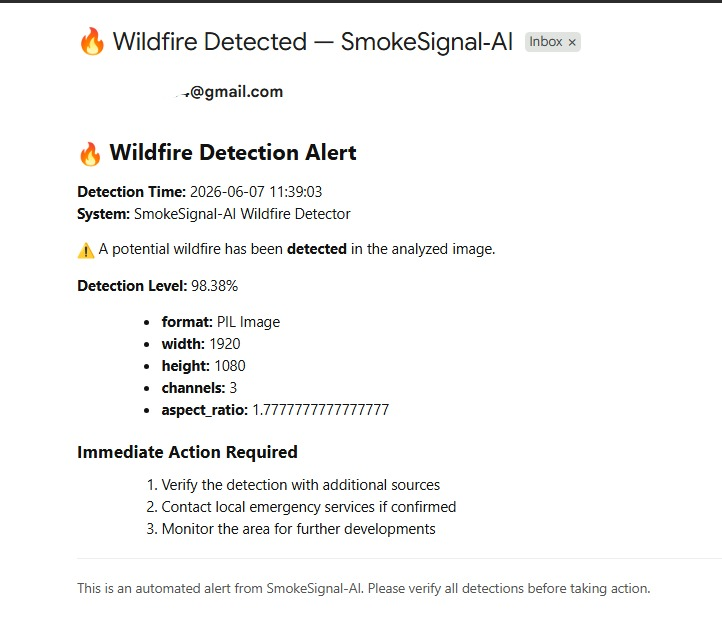

# Deployment & Monitoring Strategy

This document covers the deployment architecture, hosting configuration, email alert setup, and monitoring strategy for the **SmokeSignal-AI** wildfire detection system.

**Live Demo:** [https://smoke-signal.streamlit.app/](https://smoke-signal.streamlit.app/)

---

## 1. System Architecture Overview

The application follows a linear pipeline from image upload to alert dispatch:

```
User Upload (JPG/PNG)
        │
        ▼
┌─────────────────────┐
│  Streamlit Web UI    │  ← Hosted on Streamlit Community Cloud
│  (app.py)            │
└────────┬────────────┘
         │
         ▼
┌─────────────────────┐
│  OOD Scene Check     │  ← MobileNetV2 validates aerial/satellite imagery
│  (utils/ood.py)      │
└────────┬────────────┘
         │ Pass
         ▼
┌─────────────────────┐
│  CNN Wildfire Model  │  ← Custom trained model (64×64×3 input)
│  (model/*.keras)     │
└────────┬────────────┘
         │
    ┌────┴────┐
    │         │
 Wildfire   No Wildfire
 Detected   Detected
    │         │
    ▼         ▼
┌────────┐  ┌──────────┐
│ SMTP   │  │ Safe     │
│ Alert  │  │ Result   │
│ Email  │  │ Shown    │
└────────┘  └──────────┘
```

---

## 2. Hosting Environment

### Platform: Streamlit Community Cloud

| Detail               | Value                                            |
| --------------------- | ------------------------------------------------ |
| **Platform**          | [Streamlit Community Cloud](https://share.streamlit.io/) |
| **Live URL**          | [smoke-signal.streamlit.app](https://smoke-signal.streamlit.app/) |
| **Source Repository** | [dhyan2815/SmokeSignal-AI](https://github.com/dhyan2815/SmokeSignal-AI) |
| **Entry Point**       | `app.py`                                         |
| **Python Version**    | Specified in `runtime.txt`                       |
| **Dependencies**      | `requirements.txt`                               |

### How Streamlit Cloud Deployment Works
Streamlit Community Cloud connects directly to the GitHub repository. On every push to the configured branch, the app is automatically rebuilt and redeployed. No manual CI/CD pipeline or Docker configuration is required.

---

## 3. Model Serving

| Detail               | Value                                                   |
| --------------------- | ------------------------------------------------------- |
| **Model Format**      | TensorFlow/Keras (`.keras`)                             |
| **Model Path**        | `model/wildfire_detector_model.keras`                   |
| **Input Shape**       | `64 × 64 × 3` (RGB)                                    |
| **Serving Method**    | Loaded in-process via `tensorflow.keras.models.load_model()` |
| **Inference Runtime** | `tensorflow-cpu` (no GPU required)                      |
| **Confidence Threshold** | `0.5` (configurable in `config.py`)                  |

The model is embedded directly in the repository and loaded at application startup. There is no separate model server (e.g., TF Serving, FastAPI) — inference runs within the same Streamlit process.

---

## 4. Email Alert Configuration

### Overview
SmokeSignal-AI sends two types of automated email notifications via Gmail SMTP:
1. **Wildfire Detection Alerts** — Sent immediately when the model detects a wildfire (confidence > 0.5).
2. **User Feedback Reports** — Sent when a user reports a False Positive or False Negative via the UI.

### SMTP Details

| Detail         | Value                        |
| --------------- | ---------------------------- |
| **Provider**    | Gmail                        |
| **Protocol**    | SMTP over SSL                |
| **Host**        | `smtp.gmail.com`             |
| **Port**        | `465`                        |
| **Auth Method** | Gmail App Password           |

### Environment Variables

The following environment variables must be configured. Locally, these are set in a `.env` file (loaded via `python-dotenv`). On Streamlit Community Cloud, they are set in the **Secrets** panel.

| Variable         | Required | Description                                      |
| ----------------- | -------- | ------------------------------------------------ |
| `EMAIL_ADDRESS`   | Yes      | Gmail address used to send alerts                |
| `EMAIL_PASSWORD`  | Yes      | Gmail App Password (not your account password)   |
| `TARGET_EMAIL`    | No       | Recipient email (defaults to `admin@example.com`) |

### Local Setup (`.env` file)

```env
EMAIL_ADDRESS=your_gmail@gmail.com
EMAIL_PASSWORD=your_16_char_app_password
TARGET_EMAIL=recipient@example.com
```

### Streamlit Cloud Setup (Secrets)

In Streamlit Community Cloud, navigate to **App Settings → Secrets** and add:

```toml
EMAIL_ADDRESS = "your_gmail@gmail.com"
EMAIL_PASSWORD = "your_16_char_app_password"
TARGET_EMAIL = "recipient@example.com"
```

### How to Generate a Gmail App Password

1. Go to [Google Account Security](https://myaccount.google.com/security).
2. Enable **2-Step Verification** if not already enabled.
3. Navigate to **App Passwords** (under "Signing in to Google").
4. Select **Mail** and **Other (Custom name)**, enter `SmokeSignal-AI`.
5. Click **Generate** — copy the 16-character password.
6. Use this password as `EMAIL_PASSWORD` in your `.env` or Streamlit Secrets.

> **Note:** If email credentials are not configured, the app will still function normally for wildfire detection — alerts will simply be disabled, and the UI will show a warning banner.

---

## 5. Deployment Steps

### Option A: Local Development

```bash
# 1. Clone the repository
git clone https://github.com/dhyan2815/SmokeSignal-AI.git
cd SmokeSignal-AI

# 2. Create and activate virtual environment
python -m venv .venv
.venv\Scripts\activate        # Windows
# source .venv/bin/activate   # macOS/Linux

# 3. Install dependencies
pip install -r requirements.txt

# 4. Configure email alerts (optional)
# Create a .env file with EMAIL_ADDRESS, EMAIL_PASSWORD, TARGET_EMAIL

# 5. Run the app
streamlit run app.py
```

The app will be available at `http://localhost:8501`.

### Option B: Streamlit Community Cloud (Production)

1. Push your code to a public GitHub repository.
2. Go to [share.streamlit.io](https://share.streamlit.io/) and sign in with your GitHub account.
3. Click **"New app"** and select your repository, branch, and `app.py` as the entry point.
4. Under **Advanced settings**, configure your Python version (must match `runtime.txt`).
5. Go to **App Settings → Secrets** and add your email environment variables (see Section 4).
6. Click **Deploy** — the app will be live within minutes.
7. Subsequent pushes to the configured branch will trigger automatic redeployment.

---

## 6. Monitoring & Logging

### Current Strategy: Console-Based Logging

SmokeSignal-AI uses Python's built-in `print()` statements for runtime logging. These logs are visible in:
- **Local:** The terminal where `streamlit run app.py` is executed.
- **Streamlit Cloud:** The **Manage app → Logs** panel in the Streamlit Cloud dashboard.

### Logged Events

| Event                  | Log Format                                                                 |
| ---------------------- | -------------------------------------------------------------------------- |
| OOD Image Flagged      | `[OOD LOG] {timestamp} - Flagged OOD Image: {scene_type} (Conf: {score})` |
| User Feedback Report   | `[USER REPORT] {timestamp} - {type} reported for current image`           |
| Prediction Error       | `Prediction Error: {exception}`                                           |

### Uptime Monitoring

No dedicated uptime monitoring service (e.g., UptimeRobot, Pingdom) is currently configured. Streamlit Community Cloud provides basic health monitoring and will automatically restart the app if it becomes unresponsive due to inactivity.

### Future Monitoring Considerations

- Integrate a free uptime monitor (e.g., UptimeRobot) to track availability of the live URL.
- Add structured logging (Python `logging` module) for better log filtering and severity levels.
- Persist detection logs to a lightweight database (e.g., SQLite) for historical analysis.

---

## 7. UI & Interface

### Live Demo
The production interface is publicly accessible at:
**[https://smoke-signal.streamlit.app/](https://smoke-signal.streamlit.app/)**

### Interface Components
The Streamlit UI provides the following workflow:
1. **Image Upload** — File uploader accepting JPG/PNG images.
2. **OOD Distribution Check** — Expandable status indicator showing scene validation results.
3. **Wildfire Prediction** — Displays detection label (`🔥 Wildfire Detected` or `✅ No Wildfire Detected`) with confidence score.
4. **Email Alert Status** — Shows whether an automated alert was successfully dispatched.
5. **User Feedback** — A contextual button to report False Positives or False Negatives.

### Screenshots




