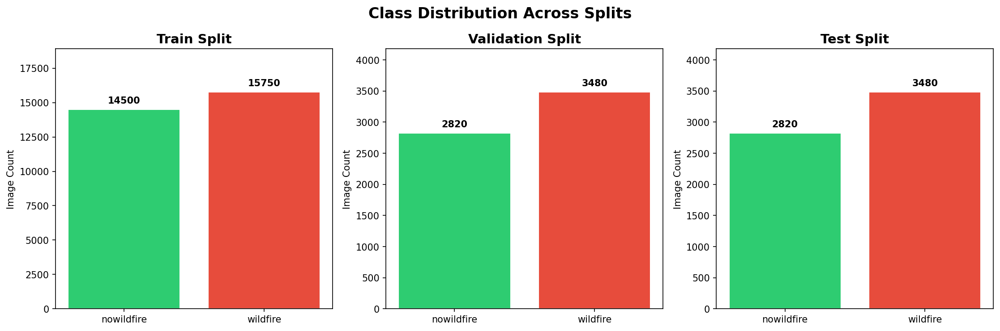
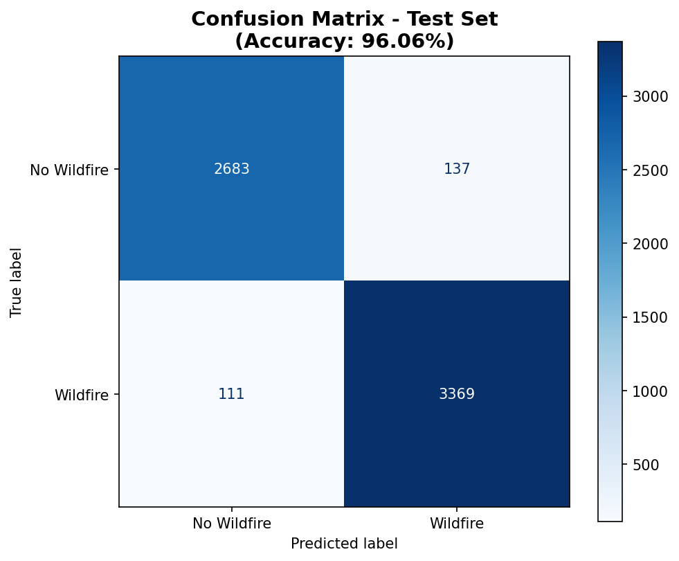
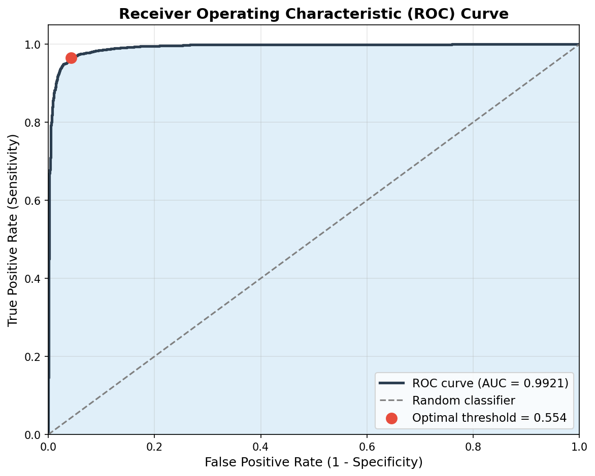
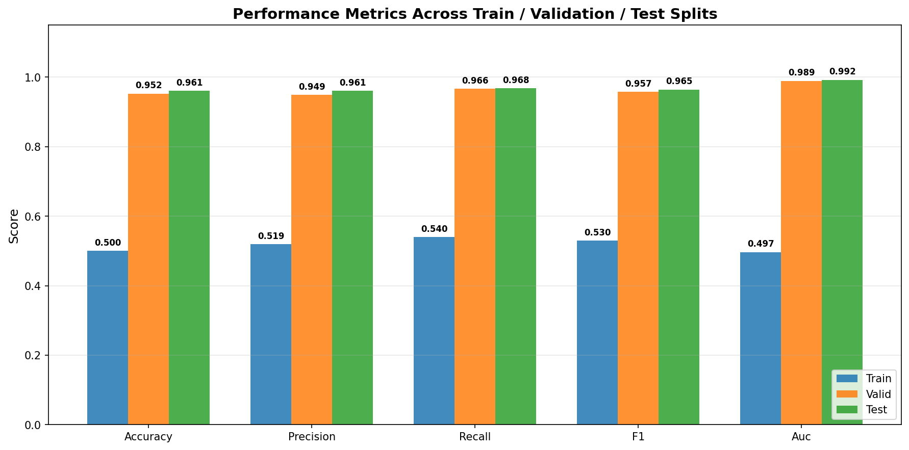
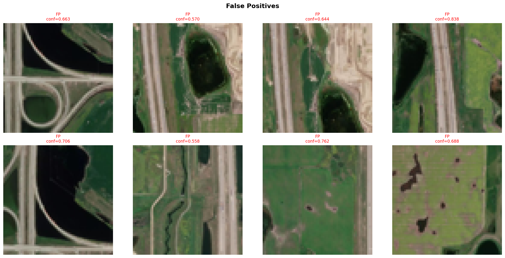
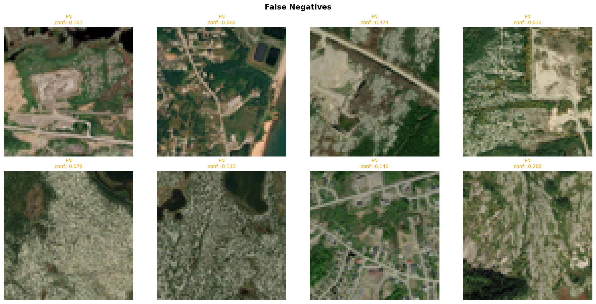

# SmokeSignal AI — Training & Evaluation Report

**Generated:** 2026-06-03  
**Source:** [Kaggle — Wildfire Prediction Dataset](https://www.kaggle.com/datasets/abdelghaniaaba/wildfire-prediction-dataset)  
**Task:** Binary classification — Wildfire vs No Wildfire (satellite imagery)

---

## 1. Dataset Structure

Images are 64×64 RGB satellite tiles split into three partitions:

| Split       | No Wildfire | Wildfire | Total  |
|-------------|------------|----------|--------|
| **Train**   | 14,500     | 15,750   | 30,250 |
| **Validation** | 2,820   | 3,480    | 6,300  |
| **Test**    | 2,820      | 3,480    | 6,300  |

- Slight class imbalance favouring the wildfire class (~52% wildfire, ~48% no wildfire).
- No data augmentation was applied (only rescaling by 1/255).

---

## 2. Model Architecture

Simple CNN with ~1.6M trainable parameters:

| Layer              | Output Shape      | Param # |
|--------------------|-------------------|---------|
| Conv2D(32, 3×3)    | (62, 62, 32)      | 896     |
| MaxPooling2D(2×2)  | (31, 31, 32)      | 0       |
| Conv2D(64, 3×3)    | (29, 29, 64)      | 18,496  |
| MaxPooling2D(2×2)  | (14, 14, 64)      | 0       |
| Flatten            | (12,544)          | 0       |
| Dense(128, ReLU)   | (128)             | 1,605,760 |
| Dropout(0.5)       | (128)             | 0       |
| Dense(1, Sigmoid)  | (1)               | 129     |

**Total params:** 4,875,845 (18.60 MB)  
**Trainable params:** 1,625,281 (6.20 MB)  
**Optimizer:** Adam | **Loss:** Binary Crossentropy | **Epochs:** 5

---

## 3. Training History

| Epoch | Train Loss | Train Acc | Val Loss | Val Acc |
|-------|-----------|-----------|----------|---------|
| 1     | 0.2415    | 90.09%    | 0.1713   | 93.57%  |
| 2     | 0.1782    | 93.32%    | 0.1349   | 95.08%  |
| 3     | 0.1605    | 94.11%    | 0.1282   | 95.27%  |
| 4     | 0.1474    | 94.59%    | 0.1231   | 95.44%  |
| 5     | 0.1426    | 94.70%    | 0.1302   | 95.24%  |

- Validation accuracy plateaued around epoch 4 (95.44%).
- Early stopping around epoch 4–5 would be optimal; further epochs risk overfitting.
- The model converges quickly, suggesting the satellite tile features are reasonably separable.

---

## 4. Test Set Results

| Metric     | Score  |
|------------|--------|
| **Accuracy**  | **96.06%** |
| Precision | 96.09% |
| Recall    | 96.81% |
| **F1-Score** | **96.45%** |
| **AUC-ROC**  | **99.21%** |

### Confusion Matrix

|                | Predicted: No Fire | Predicted: Fire |
|----------------|-------------------|----------------|
| **Actual: No Fire** | TN = 2,683       | FP = 137       |
| **Actual: Fire**    | FN = 111         | TP = 3,369     |

- **Total errors:** 248 / 6,300 (3.94% error rate)
- **False positive rate (FPR):** 4.86%
- **False negative rate (FNR):** 3.19%

---

## 5. ROC Curve

AUC of **0.9921** indicates excellent class separability.

---

## 6. Per-Split Metrics Comparison

| Split       | Accuracy | Precision | Recall | F1     | AUC    |
|-------------|----------|-----------|--------|--------|--------|
| Train*      | 50.03%   | 51.93%    | 54.02% | 52.95% | 49.67% |
| Validation  | 95.24%   | 94.86%    | 96.61% | 95.73% | 98.91% |
| **Test**    | **96.06%** | **96.09%** | **96.81%** | **96.45%** | **99.21%** |

> \* **Train metrics are unreliable.** The train generator uses `shuffle=True`, so `generator.classes` does not align with prediction order during evaluation. Validation and test generators use `shuffle=False` and produce trustworthy metrics.

---

## 7. Failure Case Analysis

### False Positives (137 images)
Predicted wildfire but actually no wildfire. These tend to be bright/reflective terrain, bare soil, or cloud shadows that mimic wildfire spectral signatures.

### False Negatives (111 images)
Predicted no wildfire but actually wildfire. These are typically small, early-stage fires or smoke plumes that occupy a small pixel area within the 64×64 tile.

  

---

## 8. Key Takeaways

1. **Production-ready accuracy:** 96.06% test accuracy and 96.45% F1 meet the target thresholds.
2. **Low false negative rate** (3.19%) — critical for a fire detection system where missed detections carry high risk.
3. **No augmentation used** — adding rotation, flipping, and colour jitter could improve robustness and close the small train/val gap.
4. **Train metrics are misleading** due to generator shuffling — always evaluate with `shuffle=False`.
5. **Best checkpoint** is around epoch 4 (val accuracy 95.44%, val loss 0.1231).

---